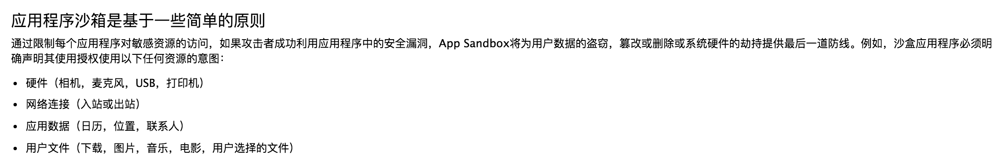
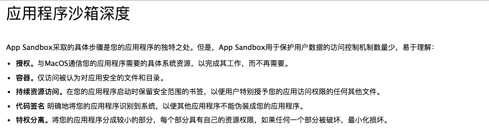
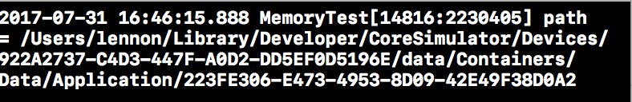
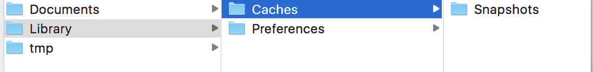
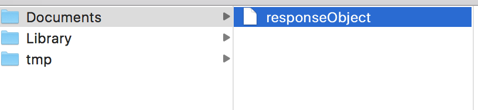
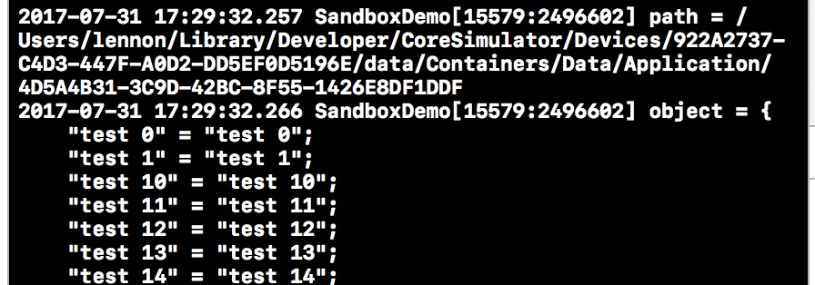
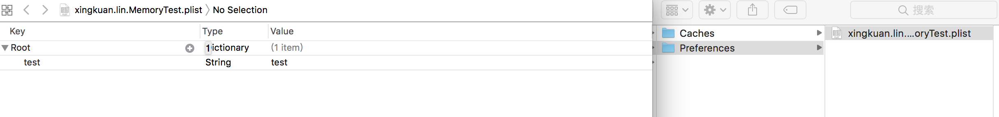
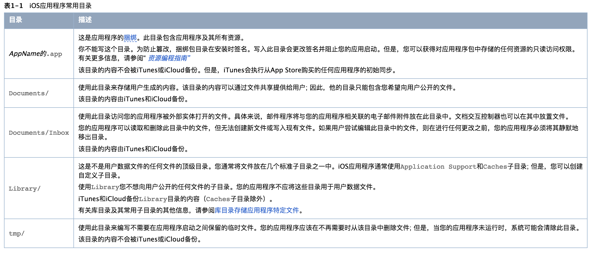

#iOS开发应用程序沙盒

##应用程序沙盒(App Sandbox,也称沙箱)

- 沙盒应用程序是通过将应用程序的特权限制在其预期功能来保护系统和用户的好方法，从而增加恶意软件危及用户系统的难度。
- 应用程序为什么需要那么多的授权(以下使用了google翻译)?[苹果这样说](https://developer.apple.com/app-sandboxing/)
 



- 如果使用相同的代码签名和标志符即可重复使用应用程序的容器,而iOS容器还包含了应用程序本身

> 所以我们只要bundleId一致, 就会直接覆盖那个App

- 对于每个用户,首次运行应用程序时,自动会创建一个沙盒
- 苹果对沙箱深度描述:





- 一个特殊的权利启用应用程序沙箱 - 打开应用程序沙箱。启用沙箱时，Xcode会创建一个.entitlements 属性列表文件，并在项目导航器中显示该文件。
> 现在还疑惑项目下多了一个:项目名+.entiliements文件吗?

##沙盒下的目录

- 在AppDelegate中使用NSHomeDirectory打印,注意在模拟器下打印,真机同样有沙盒,只是在电脑上我们看不到:

```OC
NSString *path = NSHomeDirectory();
NSLog(@"path = %@", path);
```
- 打印结果:



 - 复制path的路径,在mac首页点击前往->前往文件夹->黏贴该路径并且点击前往即可看到沙盒下的目录:



###Documents疑问和测试

- 为什么说Documents的数据在App升级的时候会跟随迁移,卸载的时候就不会存在?
- 我们新建一个App,并且使用归档的方式将数据存在Documents下:

```OC
    _responseObject = [NSMutableDictionary dictionary];
    for (NSInteger i = 0; i < 100; i++) {
        [_responseObject setObject:[NSString stringWithFormat:@"test %ld",i] forKey:[NSString stringWithFormat:@"test %ld",i] ];
    }
    // 是路径也是存储的键
    NSString *filePath = @"responseObject";
    // 存储数据
    [LXKArchiverTool archiverObject:_responseObject key:filePath filePath:filePath];

```

 - 如果对以上代码有疑问可以参考我的[归档(NSKeyedArchiver)与解归档(NSKeyUnarchiver)封装和使用时间测试](http://www.jianshu.com/p/ceac1b1fb413)
 - 可以看到我们归档成功在Documents路径下了:
 


- 根据苹果官网介绍,那么我们重新建一个App,并且使用相同的BundleId,是否能够获取到responseObject数据?
 - 同样在AppDelegate下打印家目录,对比得出目录是不一致的,但是responseObject数据是存在的,并且可以直接读取
 
 ```OC
     // 是路径也是存储的键
    NSString *filePath = @"responseObject";
    
    // 存储数据
//    [LXKArchiverTool archiverObject:_responseObject key:filePath filePath:filePath];
    // 读取数据
     id object = [LXKArchiverTool unarchiverPath:filePath key:filePath];

 ```
  


- 如果我们删除App后重新运行则数据不会再存在了

##Library

###preference

- Library/preference,用户的偏好设置,我们可以使用上面的方法在一个App使用NSUserDefaults来测试是否存在这里和是否会删除;
 - 存储代码:
 
 ```OC
 NSUserDefaults *userDef = [NSUserDefaults standardUserDefaults];
    [userDef setObject:@"test" forKey:@"test"];
    [userDef synchronize];
 ```
 - 根据目录我们可以看到是NSUserdefaults是以plist格式存储在preference里面的:
 

- 再次在另一个App获取发现依然可以读取数据,并且删除一样不存在,所以preference跟随沙盒数据在迁移,App升级的时候preference的plist一样会存在

###caches

- 当遇到这个时候我不知道怎么做,不过在[苹果官网看到:](https://developer.apple.com/library/content/documentation/FileManagement/Conceptual/FileSystemProgrammingGuide/FileSystemOverview/FileSystemOverview.html)




- 一下在连tmp都不用测试了....

###几个目录获取

- 沙盒路径:

```OC
// 沙盒路径
NSString * path = NSHomeDirectory()
```

- Documents:

```OC
NSArray * paths = NSSearchPathForDirectoriesInDomains(NSDocumentDirectory, NSUserDomainMask, YES);
```

- Library:

```OC
NSArray *paths1 = NSSearchPathForDirectoriesInDomains(NSLibraryDirectory, NSUserDomainMask, YES);
```
 - caches:
 
 ```OC
 NSArray *paths2 = NSSearchPathForDirectoriesInDomains(NSCachesDirectory, NSUserDomainMask, YES);
 ```
 - preference
 
 ```OC
 preference
 ```

-tmp: 

```OC
//temp路径
NSString * tmpDir = NSTemporaryDirectory();
```

##总结

- Documents是用于存储用户生成的内容,该目录的内容共享提供给用户,此目录只能包含想用户公开的文件,并且跟随App的升级一样存在,如果删除将不存在
- Library中可以创建自定义子目录哦(当我们有需求可以在这这儿创建),Library存储的是不想想用户公开的文件的子目录,跟随App升级都存在,除了caches子目录存在
- tem文件就是系统每一次重新启动都可能被清除,更不用说备份了
- 由此,基本可以说我们存储的数据都会跟随App升级存在,但是删除App就不会存在了,会重新创建一个新的沙盒(keychian删除也会存在,不过最好慎用).

##待验证使用知识点

- 一些路径查找API（POSIX层之上）是指用户主目录之外的应用程序特定位置。例如，在沙盒应用程序中，该NSTemporaryDirectory函数提供了一个目录的路径，该路径位于用户主目录之外，但特定于您的应用程序和沙箱内; 您对当前用户可以对其进行无限制的读/写访问。这些路径查找API的行为适用于App Sandbox，并且不需要更改代码。

- 与用户交互以扩展您的沙箱的macOS安全技术称为Powerbox。Powerbox没有API。当您使用NSOpenPanel和NSSavePanel类时，您的应用程序会透明地使用Powerbox 。您可以通过使用Xcode设置权限来启用Powerbox，如在授权密钥引用中启用用户选择的文件访问中所述
 - Powerbox提供的安全性好处在于它不能以编程方式进行操作 - 具体来说，敌方代码没有使用Powerbox访问文件系统的机制。只有一个用户通过与“打开”和“保存”对话框通过Powerbox进行交互，可以使用这些对话框来访问之前建立的沙箱之外的部分文件系统。例如，如果用户保存新文档，Powerbox会扩展您的沙箱，以便您的应用程序对文档进行读/写访问。

- 确保您的权利中指定的每个文件系统路径以'/'开头。这包括相对于当前用户的主目录的绝对路径和路径。此外，请确保“〜”字符不会出现在相对于用户主目录的路径中的任何位置。(可以测试一下)
